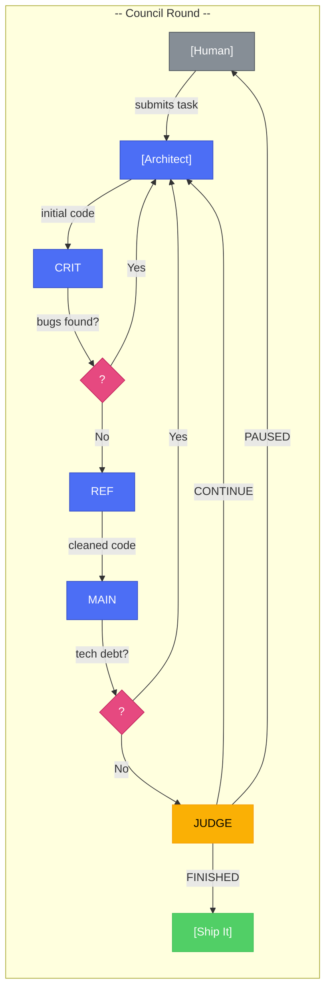

# Enclave 

**A council of AI agents that actually gets things done.**

Or at least argues about them really convincingly.

> **Note:** This project is inspired by pewdiepie's local council AI, and even though this may not be as good as his, it aims to provide a powerful local multi-agent experience.

> **⚠️ Demo Notice:** This project is still a work in progress/demo. Some features may not work as intended or might be incomplete. If you encounter any issues or have suggestions, please reach out!

---

## What Even Is This?

Enclave is a Rust-powered multi-agent system where different AI agents form an engineering council to tackle your coding tasks. It's like having a team of developers who never take breaks, never complain about meetings, and actually read the code before giving opinions.

Think of it as a nerdy Round Table, except:
- Sir Lancelot is replaced with a Critic who finds your bugs
- Sir Galahad is now a Refactorer obsessed with "clean code"
- King Arthur is the Lead Engineer who actually makes decisions
- And there's a Maintainer who reminds everyone about technical debt

*Spoiler: they don't fight over a Grail. They fight over your codebase architecture.*

---

## The Origin Story

This project was inspired by [pewdiepie's Local AI Council](https://github.com/pewdiepie-localai), a multi-agent system where several AI agents debate and modify code together. It looked amazing, except for one small problem:

```
GPU needed: 50x RTX 5090 (~$100,000)
My budget:   $0
My Device:  A potato with anode and cathode
```

So I took the same idea, **multi-agent verification where agents check each other's work**, and made it work on a single GPU (or just CPU with an API key).

The council AI approach is brilliant: instead of one AI making mistakes, multiple agents review, critique, and improve each other's work. But running 50 local LLMs requires serious hardware.

**Our solution:** Use API-based models (MiniMax, OpenAI, Anthropic) or lightweight local CLI agents that do the thinking, while keeping the same **structured verification process** where agents check each other's work.

You don't need 50 GPUs for good multi-agent code review. You just need:
- The **right process** - agents that actually verify each other's work
- The **right tools**, tools that let agents read, write, and execute
- The **right stubbornness**, enough Rust to make it work anyway

*Shoutout to pewdiepie's council AI for the inspiration. This is our budget version.* 

---

## Why Would I Want This?

- **You're tired of single-agent AI** that just spits out code and hopes for the best
- **You want verification, not just opinions** - The Critic checks the Architect's work, the Refactorer polishes it, the Maintainer future-proofs it
- **You want accountability** - Each agent's changes are reviewed by others before shipping. It's like code review, but automated and with more opinions
- **You want a process that actually catches bugs** - Multiple agents means multiple perspectives pointing out issues before they become problems
- **You want agents that can actually modify files**, not just suggest changes

### The Verification Process

Unlike single-agent AI that just modifies code whenever, Enclave uses a **structured council review**:



**How it works:**

| Round | Agent | Role |
|-------|-------|------|
| 1 | **Architect** | Writes initial code |
| 2 | **Critic** | Catches bugs & issues |
| 3 | **Refactorer** | Cleans & optimizes |
| 4 | **Maintainer** | Flags tech debt |
| 5 | **Judge** | Final verdict |

**Feedback loops:**
- Critic finds bugs → Architect revises
- Maintainer flags issues → Refactorer reworks
- Judge says CONTINUE → Back to Architect
- Judge says PAUSED → Waits for human input


---

## Features

### The Council
- **Architect** - Starts with the game plan, writes the foundation
- **Critic** - Finds every bug, security hole, and "what if" scenario
- **Refactorer** - Makes your code pretty and efficient (you're welcome)
- **Maintainer** - Asks "but what about next year?" so you don't have to
- **Lead Engineer** - The final boss who decides if it's actually done

### Technical Goodies
- **Parallel deliberation** - Agents think simultaneously (like your brain during a debate)
- **Tool Arsenal (21 tools)** - read_file, write_file, grep, glob, edit_file, and friends
- **MCP Support** - Bring your own tools from the Model Context Protocol ecosystem
- **MCP Connection Pooling** - Reuses MCP server connections for faster tool execution
- **Context Management** - Auto-summarizes long conversations before tokens go kaboom
- **Permission Modes** - Plan mode (read-only), Autonomy mode (do-whatever), or something in between
- **Session Persistence** - Pick up exactly where you left off
- **Real-time Streaming** - Watch the chaos unfold via SSE
- **Web Configuration API** - Configure API keys and settings via `/api/config` endpoint

### The Interface
- **Web Dashboard** - Fancy dark mode UI (your eyes will thank you)
- **CLI Mode** - For the terminal purists
- **Folder Picker** - Click click done
- **Session Management** - Save, resume, clear, start over
- **Configuration API** - Configure via web UI or REST API

---

## Quick Start

### 1. Clone & Build

```bash
git clone https://github.com/joy-arz/Enclave---Council-AI-Agents.git
cd Enclave---Council-AI-Agents
cargo build --release
```

### 2. Set Up Environment

```bash
cp .env.example .env
# Edit .env and add your MINIMAX_API_KEY
```

### 3. Run It

```bash
# Web UI mode (recommended for the full experience)
cargo run --release -- --server

# Then open http://localhost:8000
```

**OR** for the CLI warriors:

```bash
cargo run --release -- "Add user authentication to the login endpoint"
```

---

## Configuration

Create a `.env` file or set environment variables:

```env
# Who controls each agent? (minimax = API, gemini/qwen = CLI binary)
STRATEGIST_BINARY=minimax
CRITIC_BINARY=minimax
OPTIMIZER_BINARY=minimax
CONTRARIAN_BINARY=minimax
JUDGE_BINARY=minimax

# MiniMax API (default, because MiniMax is cool)
MINIMAX_API_KEY=your_key_here
MINIMAX_MODEL=MiniMax-M2.5
MINIMAX_BASE_URL=https://api.minimax.io/anthropic

# Behavior
AUTONOMOUS_MODE=true      # Let agents modify files? (true = yes, false = propose only)
MAX_ROUNDS=7             # How long the debate goes
MAX_TOKENS_PER_AGENT=1000 # Words per agent response
```

### MCP Configuration

Want more tools? Configure MCP servers:

```env
# JSON format
MCP_CONFIG='{"servers":[{"name":"filesystem","command":"npx","args":["-y","@modelcontextprotocol/server-filesystem","/tmp"]}]}'

# Or string format (because variety is nice)
MCP_SERVERS=filesystem:npx:-y,@modelcontextprotocol/server-filesystem,/tmp
```

---

## How The Council Works

```
You: "Build me a React app!"

Round 1:
├── Architect: "Here's the plan: Vite, React, TypeScript, profit."
├── Critic: "What about error boundaries? XSS vulnerabilities? Your variable names?"
├── Refactorer: "Your useEffect is 47 lines long. I can't breathe."
└── Maintainer: "This will be a nightmare to maintain in 3 months."

Round 2:
├── Architect: "Fixed the issues, added error handling."
├── Critic: "Better. But what if someone passes null to the API?"
├── Refactorer: "Still ugly. Let me refactor that into 12 micro-components."
└── Maintainer: "I'm still worried about the database migrations."

...

Round N:
└── Lead Engineer: "FINISHED. The code compiles. Ship it."
```

---

## Modes

### Autonomous Mode (Default)
Agents modify files directly. Fast and efficient. Use when you:
- Trust the agents (statistically, you probably shouldn't fully)
- Have version control to blame when things break
- Are feeling adventurous

### Propose Mode
Agents suggest changes. You review and click "Apply". Use when you:
- Want to feel like a manager
- Don't trust autonomous AI with your 47-state production app
- Enjoy the drama of watching agents propose and then reject each other's ideas

---

## Security

- **Workspace Sandbox** - Agents can't escape and touch your `/etc/passwd`
- **Permission Tiers** - Choose how much power you give the agents
- **Path Traversal Protection** - `../` is not your friend here
- **Dangerous Command Blocking** - `rm -rf /` won't fly. Sorry.

---

## The Agents Have Opinions

Here's what each agent secretly thinks:

| Agent | Their Opinion Of Your Code |
|-------|---------------------------|
| Architect | "I see potential. Let me build a foundation." |
| Critic | "I see bugs. I see security holes. I see everything." |
| Refactorer | "I see 47 ways to make this cleaner." |
| Maintainer | "I see maintenance nightmares. I'm already tired." |
| Lead Engineer | "I see a verdict." |

---

## Troubleshooting

**Agents not responding?**
- Are the CLI binaries in your PATH? Run `which qwen` or `which gemini`
- Check if your API key is valid (no, "12345" doesn't count)

**Session errors?**
- Is `.enclave_history.json` writable?
- Did you delete your history file? Shame on you.

**Memory issues?**
- Lower `MAX_TOKENS_PER_AGENT`
- Reduce `MAX_ROUNDS` for simpler tasks
- Or just accept that long debates have consequences

---

## Contributing

Found a bug? Have a feature request? Want to contribute code? The Critic will judge you regardless, but here's how to try anyway:

1. **Fork it** (the repo, not the project maintainer's sanity)
2. **Create your feature branch** (`git checkout -b feature/cool-thing`)
3. **Run tests** (`cargo test` - all 17 tests must pass)
4. **Run clippy** (`cargo clippy` - no warnings)
5. **Commit your changes** (`git commit -m 'Add cool thing'`, be honest, we all copy-paste Stack Overflow anyway)
6. **Push to the branch** (`git push origin feature/cool-thing`)
7. **Open a Pull Request** (PRs are like 同人作品, someone else's work you want to officially adopt)
8. **Wait for the Critic to review** (they will find something. They always do. It's their purpose.)

*Warning: The Critic has never met a codebase they couldn't find issues with. This is a feature, not a bug. Unless told otherwise, by who you may ask? By me.*

---

## Recent Improvements

- **MCP Connection Pooling** - Reuses MCP server connections for 200-600ms faster tool calls
- **Buffered Logging** - Removed disk sync on every log for better performance
- **Batched SSE Streaming** - CLI responses now stream in chunks instead of character-by-character
- **Real Client IP** - Rate limiting now uses actual client IP from TCP connection
- **Web Config API** - Configure API keys and settings via `/api/config` endpoint

---

## Credits

- **Inspired by** pewdiepie's local council AI (yes, really)
- **Built with** Rust because we like our code fast and our builds slower than everything else
- **Powered by** MiniMax, OpenAI, Anthropic, or whatever CLI binary you throw at it

---

## License

MIT. Do whatever you want. Credit is nice but not required.

---

**Enjoy building with Enclave!** 

*Remember: The agents are always right. Except when they're arguing with each other.*
