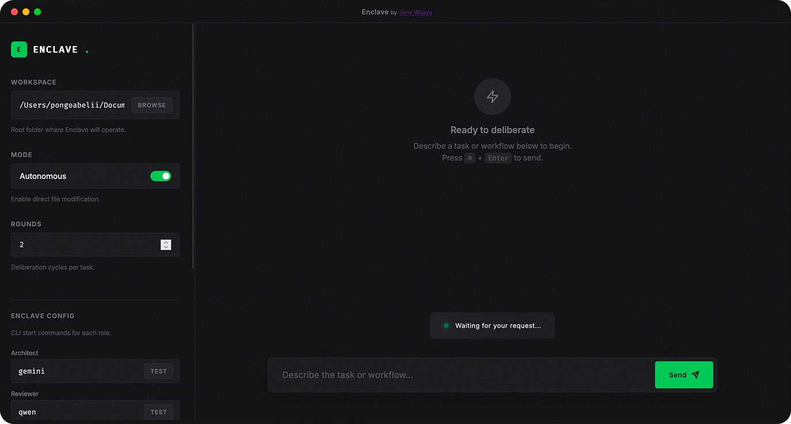
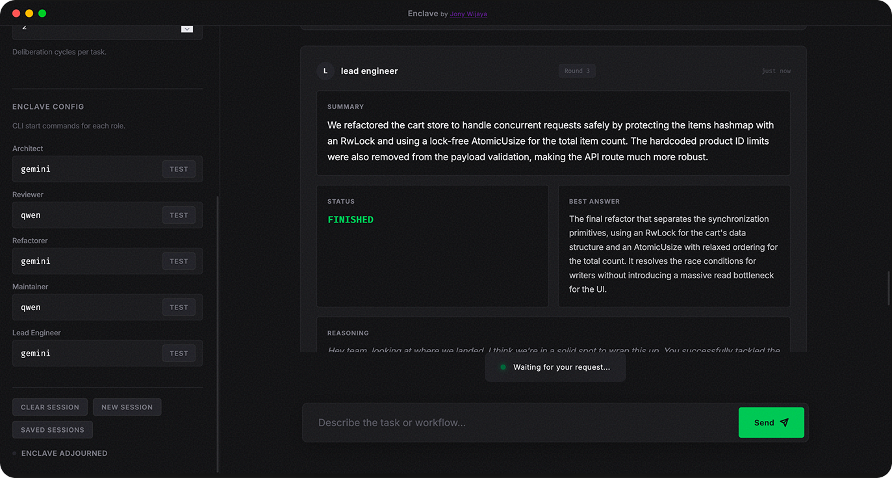

# Enclave (Rust)

A high-performance, multi-agent AI engineering system built with Rust. This system orchestrates local CLI agents (like `gemini` or `qwen`) to collaborate as active engineering partners, directly modifying the project's codebase until tasks are complete.

> **note:** This project is inspired by pewdiepie's local council AI, and even though this may not be as good as his, it aims to provide a powerful local multi-agent experience.

> **⚠️ Demo Notice:** This project is still a work in progress/demo. Some features may not work as intended or might be incomplete. If you encounter any issues or have suggestions, please reach out!





---

## Contact

Found a bug? Have a feature request? Want to contribute?

- **Contact Form:** [https://www.joyarz.space/](https://www.joyarz.space/) (use the contact form on my portfolio)
- **Email:** Direct email via the contact form above

---

## Overview

Enclave transforms how you work by bringing in a team of AI agents that don't just discuss code—they actively improve it. Unlike traditional AI assistants that merely suggest changes, Enclave agents can actually modify your codebase, run tests, and refactor components based on your tasks.

The system uses a structured deliberation process where different specialized agents analyze tasks from their unique perspectives, debate solutions, and reach consensus—much like a real engineering team.

---

## Features

- **Modern OLED Dashboard**: A minimalist, deep-black interface designed for high-density engineering workflows.
- **Active Engineering Partners**: Agents don't just talk; they **act**. In autonomous mode, they use tools to edit files, refactor code, and run shell commands.
- **Propose & Review**: In non-autonomous mode, agents suggest file changes that can be reviewed and applied with a single click.
- **Auto Rounds**: Agents automatically determine when to stop deliberation (enabled by default). Toggle off to use fixed round limits.
- **Workspace Folder Selection**: Browse and select your project directory directly from the web UI using a native folder picker (supports macOS and Windows).
- **Workflow-Driven Deliberation**: The enclave follows a structured engineering journey (architect → reviewer → refactorer → maintainer → lead engineer).
- **Enclave Configuration**: Dynamically map different local CLI models to specific workflow roles directly from the sidebar.
- **Session Persistence**: All sessions are automatically saved to `.enclave_history.json` and can be resumed from the "Saved Sessions" modal.
- **Project State Persistence**: Maintains a `.enclave_state.md` file in the workspace to track progress across sessions.
- **Autonomous Mode Toggle**: A safety switch that grants agents permission to use their internal tools (like `write_file`) to modify the local workspace.
- **Real-Time Streaming**: Watch the enclave's deliberation and file edits in real-time via SSE.
- **Graceful Shutdown**: Server shuts down cleanly on Ctrl+C, completing in-flight requests.

---

## Architecture

### How Enclave Works

Enclave operates through a structured multi-round deliberation process:

1. **Round Start**: The Architect speaks first, establishing the technical approach and baseline implementation.
2. **Parallel Analysis**: All other agents (Reviewer, Refactorer, Maintainer) analyze the task simultaneously, each from their specialized perspective.
3. **Synthesis**: The Lead Engineer reviews all contributions and issues a verdict:
   - `FINISHED` - Task is complete
   - `CONTINUE` - More work needed, enclave proceeds to next round
   - `PAUSED` - Task requires human input or clarification

### Agent Roles

| Role | Purpose |
|------|---------|
| **Architect (Strategist)** | Designs the technical roadmap and implements foundational changes |
| **Reviewer (Critic)** | Rigorously checks for bugs, security risks, and edge cases |
| **Refactorer (Optimizer)** | Optimizes code for performance, readability, and style |
| **Maintainer (Contrarian)** | Ensures long-term sustainability and challenges assumptions |
| **Lead Engineer (Judge)** | Evaluates the workflow and issues final verdicts |

### Session Management

Sessions are automatically persisted to `.enclave_history.json` in your workspace. This enables:

- **Session Continuation**: Pick up exactly where you left off
- **Saved Sessions Modal**: View and resume any previous session
- **Session Clearing**: Clear the UI while keeping session history for continuation

---

## Getting Started

### Prerequisites

- **Rust**: Install via [rustup](https://rustup.rs/)
- **CLI Agents**: Ensure you have at least one supported CLI agent installed and accessible in your path (see Supported AI Providers below)
- **Workspace**: A project directory where Enclave will operate

### Supported AI Providers

Enclave supports both CLI agents and API-based providers. Select your preferred provider for each agent role directly from the UI dropdown.

#### CLI Agents

CLI agents run locally and can accept prompts via stdin. Autonomous mode flags are automatically applied:

| CLI Agent | Autonomous Flag | Notes |
|-----------|-----------------|-------|
| **Qwen** (`qwen`) | `-y` | Use `qwen -y` or `--approval-mode yolo` |
| **Gemini** (`gemini`) | `-y` | Google Gemini CLI |

#### API Providers (Default: MiniMax)

**MiniMax** is the default provider. It uses the Anthropic-compatible endpoint and supports the M2.5/M2.7 models.

| API Provider | Model | Endpoint | Notes |
|--------------|-------|---------|-------|
| **MiniMax** (`minimax`) | MiniMax-M2.5 | Anthropic-compatible (`/v1/messages`) | Requires `MINIMAX_API_KEY` |

**MiniMax Setup:**
1. Get your API key from [platform.minimax.io](https://platform.minimax.io)
2. Subscribe to the Token Plan for access to M2.5/M2.7 models
3. Set `MINIMAX_API_KEY` in your `.env`

**How it works:** When autonomous mode is enabled, Enclave automatically detects the CLI agent and appends the appropriate flag to enable auto-approval of file edits and shell commands.

**CLI Examples:**
```bash
# Qwen - YOLO mode
qwen -y "fix the bug"

# Gemini - YOLO mode
gemini -y "refactor this"
```

### Configuration

Set up your environment variables by copying the template:

```bash
cp .env.example .env
```

Open `.env` and configure:

```env
# Provider Selection - CLI: gemini, qwen | API: minimax (default)
STRATEGIST_BINARY=minimax
CRITIC_BINARY=minimax
OPTIMIZER_BINARY=minimax
CONTRARIAN_BINARY=minimax
JUDGE_BINARY=minimax

# MiniMax API (Anthropic-compatible endpoint)
MINIMAX_API_KEY=your_key_here
MINIMAX_MODEL=MiniMax-M2.5
MINIMAX_BASE_URL=https://api.minimax.io/anthropic

# Session defaults
MAX_ROUNDS=7
MAX_TOKENS_PER_AGENT=1000
DEFAULT_TEMPERATURE=0.7
HOST=127.0.0.1
PORT=8000
AUTONOMOUS_MODE=true
```

### Building

```bash
# Development build
cargo build

# Release build (optimized)
cargo build --release
```

---

## Usage

### Server Mode (Web UI)

Start the web interface:

```bash
cargo run -- --server
```

Access at `http://localhost:8000`

**Sidebar Controls:**

| Control | Description |
|---------|-------------|
| **Workspace** | Select the project directory for agents to work in |
| **Browse** | Open native folder picker |
| **Autonomous** | Toggle to allow agents to modify files directly (default: on) |
| **Auto Rounds** | When on, agents decide when to stop (default: on) |
| **Max Rounds** | Maximum deliberation cycles (only applies when Auto Rounds is off) |
| **Enclave Config** | Configure CLI binary for each agent role |

**Session Controls (Bottom of Sidebar):**

| Button | Description |
|--------|-------------|
| **Clear Session** | Clear the current session's UI display |
| **New Session** | Start a completely new session |
| **Saved Sessions** | Open modal to view and resume previous sessions |

### CLI Mode

Run a one-off task from the terminal:

```bash
cargo run -- "Add user authentication to the login endpoint"
```

With custom rounds:

```bash
cargo run -- --rounds 3 --workspace /path/to/project "Refactor the database layer"
```

---

## Autonomous vs Propose Mode

### Propose Mode (Default)

Agents analyze your task and suggest changes, but **cannot modify files**. Each proposed change appears as a card with an "Apply Change" button. You review each suggestion before accepting.

**Use when:**
- You want full control over code changes
- You need to review AI suggestions before implementation
- Working in a sensitive production environment

### Autonomous Mode

Agents have permission to use their internal tools (`write_file`, `replace`, `run_shell_command`) to directly modify your workspace. Changes are applied immediately without confirmation.

**Use when:**
- You trust the agents and want maximum productivity
- Working in a development/test environment
- You have version control to revert any issues

---

## Security & Safety

- **Read-Only by Default**: Agents are instructed not to modify files unless autonomous mode is enabled
- **Stateful Continuity**: Enclave reads `.enclave_state.md` at session start to track progress
- **XSS Protection**: All agent output and tool logs are rendered safely in the UI
- **Path Traversal Protection**: File operations are sandboxed to the workspace directory
- **Confirmation Required**: In non-autonomous mode, every file change requires explicit approval

---

## File Structure

```
enclave/
├── src/
│   ├── main.rs           # Entry point, server & CLI modes
│   ├── cli.rs            # CLI argument parsing
│   ├── api/
│   │   ├── routes.rs     # HTTP API endpoints
│   │   └── sessions_mod.rs # Session storage
│   ├── core/
│   │   ├── orchestrator_mod.rs  # Enclave orchestration
│   │   ├── memory.rs     # Sliding window context
│   │   └── providers_mod.rs     # CLI provider abstraction
│   ├── agents/
│   │   ├── base.rs       # Base agent structure
│   │   ├── roles.rs      # Role definitions
│   │   └── judge.rs      # Lead engineer agent
│   └── ui/
│       ├── index.html    # Dashboard UI
│       └── script.js     # Frontend logic
├── .env.example          # Environment template
├── CONTRIBUTING.md       # Contribution guidelines
├── LICENSE               # MIT License
└── Cargo.toml           # Dependencies
```

---

## Troubleshooting

### Agents Not Responding

1. Verify CLI binaries are in your PATH
2. Test each agent binary individually from the sidebar
3. Check the terminal for error messages

### "Session Not Found" Errors

- Sessions are stored in `.enclave_history.json` in your workspace
- If the file is deleted or corrupted, start a new session
- The workspace directory must be writable

### High Memory Usage

- Reduce `MAX_TOKENS_PER_AGENT` in your `.env`
- Limit `MAX_ROUNDS` for simpler tasks
- The memory system uses a sliding window to manage context size

### Autonomous Mode Changes Not Persisting

- Ensure the workspace directory path is correct
- Verify write permissions on the workspace
- Check that agents are receiving the autonomous flag

---

## Environment Variables Reference

| Variable | Default | Description |
|----------|---------|-------------|
| `STRATEGIST_BINARY` | `minimax` | Provider for Architect |
| `CRITIC_BINARY` | `minimax` | Provider for Reviewer |
| `OPTIMIZER_BINARY` | `minimax` | Provider for Refactorer |
| `CONTRARIAN_BINARY` | `minimax` | Provider for Maintainer |
| `JUDGE_BINARY` | `minimax` | Provider for Lead Engineer |
| `MINIMAX_API_KEY` | - | MiniMax API key (Token Plan) |
| `MINIMAX_MODEL` | `MiniMax-M2.5` | MiniMax model name |
| `MINIMAX_BASE_URL` | `https://api.minimax.io/anthropic` | MiniMax endpoint |
| `WORKSPACE_DIR` | `./workspace` | Default workspace directory |
| `AUTONOMOUS_MODE` | `true` | Default autonomous setting |
| `MAX_ROUNDS` | `7` | Default deliberation rounds (ask judge after round 3) |
| `MAX_TOKENS_PER_AGENT` | `1000` | Token limit per agent response |
| `DEFAULT_TEMPERATURE` | `0.7` | Sampling temperature |
| `HOST` | `127.0.0.1` | Server bind address |
| `PORT` | `8000` | Server port |

---

## License

This project is licensed under the MIT License - see [LICENSE](LICENSE) for details.
